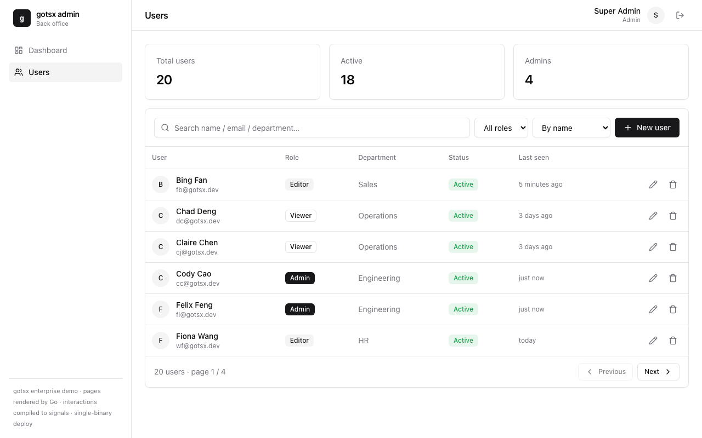
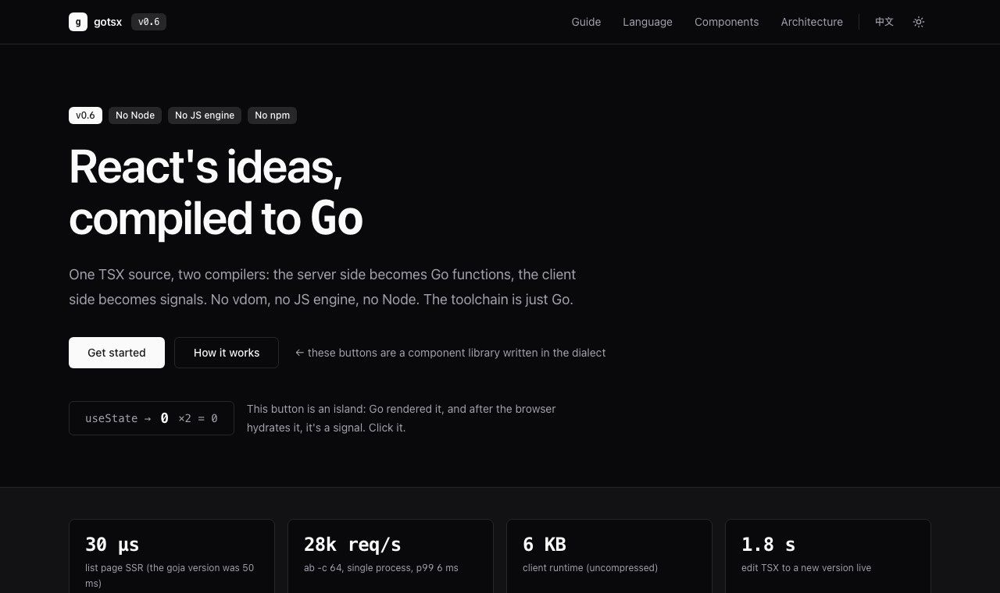

# gotsx

[](https://github.com/childrentime/gotsx/actions/workflows/ci.yml)
[](https://pkg.go.dev/github.com/childrentime/gotsx/runtime)
[](https://goreportcard.com/report/github.com/childrentime/gotsx)
[](https://childrentime.github.io/gotsx/)
[](LICENSE)

[English](README.md) · **中文**

**借 React + TSX 的思想、编译到 Go 原生的全栈框架。** 一份 TSX 源码, 两个编译器: 服务端组件编成 Go 函数, 客户端岛编成 signals。没有 vdom、没有 JS 引擎、没有 Node、没有 npm、没有 esbuild —— **工具链只有 Go**。

> **状态: v0.6 · 路线图已清零, 接口面写在 [`STABILITY.md`](STABILITY.md) · 仍在 1.0 之前。** 端到端可用的框架 —— 编译器 + 两个后端 + 运行时 + 流式 SSR + 带自动刷新的 dev 循环 + 脚手架 + 编辑器服务(诊断、hover、跳转定义)+ 共享设计系统 + 四个真实应用(含完整电商)+ 测试套件。语言是有意为之的静态子集(见下); 1.0 之前还差的是独立安全审计。见[路线图](#路线图)。

```tsx
// app/pages/index.server.tsx —— 编成 Go 函数, 永远不进浏览器
import type { PageProps } from "gotsx";
import { models } from "host:data";              // Go 实现; 类型由反射生成, 调用零编组
import Layout from "../components/Layout.server";

export default function Home({ query }: PageProps) {
  if (query.legacy !== "") return redirect("/");  // 页面级控制流: redirect() / notFound()
  const list = models.search(query.q ?? "");     // 同步: 并发由 goroutine 提供, 语言里没有 async
  return <Layout title="商品">
    <ul>{list.map((m) => <li>{m.title} · ¥{m.price}</li>)}</ul>
  </Layout>;
}
```

```tsx
// app/islands/Counter.client.tsx —— 同一份源码: 服务端 SSR, 客户端交互
import { useState, useEffect } from "gotsx";
export default function Counter({ start }: { start: number }) {
  const [n, setN] = useState(start);
  const double = n * 2;                           // 依赖 n → 自动编成 memo, 不需要 useMemo
  useEffect(() => { console.log(n); }, []);       // 空依赖 = 挂载跑一次
  return <button onClick={() => setN(n + 1)}>{n} ×2 = {double}{n > 4 && <b> 🔥</b>}</button>;
}
```

<p align="center">
  
  <br><sub><code>shop</code> 示例 —— 192 件商品、购物车、结算、中英双语 —— 每个页面都是 TSX 编译出的 Go 函数, 交互部分是岛。</sub>
</p>

<table>
  <tr>
    <td></td>
    <td></td>
  </tr>
  <tr>
    <td align="center"><sub><code>admin</code>: 鉴权、CRUD 表格、模态框、toast</sub></td>
    <td align="center"><sub><code>site</code>: 文档站本身用 gotsx 写, 暗色模式由设计 token 驱动</sub></td>
  </tr>
</table>

## 为什么

**核心洞察: SSR 是一次同步的、单趟的求值。** 没有重渲染、没有 effect、setter 永远不会被调用。所以服务端不需要 React 运行时 —— 只需要组件的"渲染切片", 它的语义小到可以直接编译成 Go。结果: 50 件商品的列表页在 Go 里 **~15 µs** 渲染完(直线式写入, ~140 次分配); 4 vCPU 的 GitHub runner 上 **~20k req/s** —— 与 templ 持平, 约是 `html/template` 的 4 倍、Next.js 的 65 倍 —— 峰值 **21 MB 内存**、**20 ms 冷启动**; 首屏 JS **gzip 后 9KB**(signals 运行时 + 加载器 + 岛; morph 库在第一次跳转时加载), `go build` 出单个二进制, `delve` / `pprof` / `go test` 全能用。数据与方法: [`bench/`](bench/README.md)。

## 快速开始

```bash
go install github.com/childrentime/gotsx/cmd/gotsx@latest
gotsx new hello && cd hello   # 脚手架: 独立 Go 模块、宿主模块、带 meta 的页面、调用类型化 action 的 keyed 列表岛、
                              # 带 CSRF 与 flash 消息的表单、给 coding agent 的 AGENTS.md + CLAUDE.md(--db sqlite 用真实数据库)
gotsx dev                     # http://localhost:3000 —— 改 app/**/*.tsx, 浏览器自动刷新; 编译错误直接浮层显示在页面上
go build -o hello . && ./hello -addr :8080        # 生产: 一个自包含的二进制
```

和 coding agent 一起用? 脚手架的 `AGENTS.md` 带一个托管块, 告诉 agent 这不是 React/Next.js, 并指向
`app/.gen/docs/`——六份短文档(语法表、约定、Go 侧、错误信息、工作流), 由 `gotsx build` **按你正在用的 gotsx 版本**写出
(`gotsx docs` 可以直接打印)。

开发框架本身:

```bash
git clone https://github.com/childrentime/gotsx && cd gotsx
go run ./cmd/gotsx tailwind   # 一次: 把 Tailwind standalone 二进制下到 .tools/(不需要 Node)
make dev-shop                 # Temu 风格电商 demo → http://localhost:3000
make dev-site                 # 本框架的文档站  ·  make dev-example  ·  make dev-admin
make test                     # gen + go test ./...(会构建全部四个示例应用)
```

> `*/gen` 是 gitignore 的, 任何编译示例应用的命令都要先 `make gen`。CI 已按此顺序编排。

## 命令行

| 命令 | 作用 |
|---|---|
| `gotsx new <dir>` | 在独立模块里脚手架一个应用(`--module`、`--tailwind`、`--db sqlite` 生成纯 Go SQLite 宿主、`--replace <checkout>` 指向本地框架检出); 同时写 `AGENTS.md` / `CLAUDE.md` |
| `gotsx build [dir]` | hostgen → Tailwind → 方言 → `gen/`(Go + 客户端 JS + 类型化 action 注册表 + 内嵌资源 + 编辑器类型声明); 顺带刷新 `app/.gen/docs/` 与 `AGENTS.md` 的托管块 |
| `gotsx dev [dir]` | build + `go build` + 运行, 监视 `app/ host/ public/ main.go`, 改动即重启; 浏览器**自动刷新**并显示**编译错误浮层**(旧版本继续跑); 浏览器里的 `console.error` 与 JS 错误转发到终端; `.gotsx/dev.json`(pid/port/url)与 `.gotsx/diagnostics.json` 把状态暴露给编辑器和 agent(第二个 `gotsx dev` 会拒绝启动); 重建是**增量的** |
| `gotsx check [dir]` | 只检查不生成; 诊断格式 `file:line:col: message`(`--json` 给工具); 有错 exit 1 |
| `gotsx export [dir]` | **静态导出**: 构建、运行、爬遍所有路由(含各语言), 按 `--base /子路径` 与 `--site https://host` 改写链接, 把资源拷进 `--out dist`——本仓库的文档站就是这样部署到 GitHub Pages 的 |
| `gotsx docs [name]` | 打印随版本走的文档(`index language conventions runtime errors agent-workflow`) |
| `gotsx lsp` | LSP over stdio: 实时诊断、**hover**(类型、props 签名、宿主方法签名)、**跳转定义**(能跳进宿主方法的 Go 源码)—— VS Code / Neovim / Helix / Zed 见 [`editors/`](editors) |
| `gotsx tailwind` | 下载当前系统的 Tailwind v4 standalone CLI(macOS、Linux、Windows) |

`gotsx.json` 是可选的: 应用的导入路径从 `go.mod` 推断, `host/` 自动识别。

## 一份源码, 两个编译器

```
.tsx ──▶ 前端: 手写的 TSX 子集 parser + 类型检查 + 方言围栏 + 服务端/客户端边界
          ├─▶ Go 后端:  组件 → Go 函数, JSX → gotsx.El/Text/If/Nodes, hooks → 单趟语义,
          │             host:* → 直接 Go 调用; //line 指令把报错指回 .tsx
          └─▶ JS 后端:  组件 → 函数, useState → signal, 依赖 signal 的 const → memo,
                        JSX → el/t/text/cond/each(写了 key={…} 就是 keyed); 走位 hydrate, 无 diff
Go 侧: 生成的 *_gen.go 与你的 main.go / host 包一起编译成一个二进制
```

| 目录 | 内容 |
|---|---|
| `compiler/` | `lexer` / `parser` / `check` / `gogen` / `jsgen` / `compile`(+ 给 check/LSP 用的 `Analyze`) |
| `runtime/` | 节点模型、hydrate 标记、方言内建、HTTP(CSP/CSRF/gzip/缓存/健康检查/优雅关闭)、请求 cookie、`Before` 钩子、宿主类型反射、i18n、redirect/notFound |
| `client/` | signals、`el/t/text/cond/each`(keyed 复用)、走位 hydrate、岛加载器、SPA 跳转、进度条、预取、跨岛 `emit`/`on`、i18n、dev 自动刷新 |
| `cmd/gotsx/` | `new` / `build` / `dev` / `check` / `lsp` / `tailwind` |
| `editors/` | VS Code(扩展源码)、Neovim、Helix、Zed 的 LSP 接入 |
| `design/` | **gotsx UI**: 共享设计系统(shadcn 风格的中性 token + 组件类)—— Tailwind v4 层和一份等价的手写 CSS, 所有 demo 和 `gotsx new` 都用它 |
| `example/` `site/` `shop/` `admin/` | 真实应用, 也是集成测试(`example` 有语言"厨房水槽"、流式 `Suspense` 面板和 `_layout` / `_404` / `_error` 约定) |

## 语言: 借 TSX 语法的静态子集

它不是 TypeScript 的实现, 而是**一门借 TSX 语法的静态语言**(AssemblyScript 的表亲): 类型系统限定在 Go 能表示的集合里。每个表达式都能推出一个静态类型且落在允许集合里就能编译; 否则是带 `file:line:col` 的编译错误 —— 构建时、`gotsx check`、或编辑器里实时给出。

- **有**: 函数组件 / props / 解构 + 默认值; `string`(rune)/ `number`(float64)/ `boolean` / 数组 / `Record` / 已知形状的对象 / `interface … extends`; `if` / `for-of` / `for (;;)` / `while` / `switch` / `break` / `continue` / `try`; `++ -- += -= *= /= %=`; `&& || ?? 三元`; `=== !==`; 模板字符串; **正则字面量**(RE2 子集, 编译期校验: `re.test`, `s.match/replace/replaceAll/split/search`); 数组 `map filter find findIndex some every forEach includes indexOf lastIndexOf join slice concat sort reduce reverse flat at` 以及原地修改的 `push pop shift unshift splice`; 字符串方法(含 `padStart/padEnd/trimStart/trimEnd/localeCompare/at`); `Object.keys/values/hasOwn`、`delete m[k]`; `Math.*`; **`Date.now/Date.parse/isoDate`**; `useState/useMemo/useEffect(+[])`; 带 `key` 的 JSX; **`<Suspense fallback>`**(服务端); 模块级 `const`; `host:*`(服务端); `redirect()/notFound()`(服务端页面); `fetch`/DOM/`await`(客户端)。
- **没有(是编译错误, 不是静默)**: `class`/`this`/原型/`new`; `any` 上的成员访问; `==`; `do-while`、`for-in`; 自定义泛型; 正则的 lookaround / 反向引用; 给岛传 `children`; 原地修改 `useState` 的数组(用 `setXs([...xs, x])`)。
- **语义约定**(两端一致): 可选的原始类型用零值表示缺席(`""`/`0`/`false`), 所以 `??` 与 `||` 是同一个运算符; 可选的对象(如 `find()` 没找到)是假值且 `=== undefined`; `Record` 读缺席的键得到零值, `Object.hasOwn` 判断存在; 服务端的对象是值语义。完整清单是 [`STABILITY.md`](STABILITY.md) 的 Stable 层。

完整可搜索的语法表在 `site` 文档的 `/docs/language`。

## 特性

- **宿主模块**: `import { models } from "host:data"` 背后是 Go; 编译后是零编组的直接调用, 类型(含真实参数名)反射成 `host.d.ts`。`(T, error)` 方法的 error 变成请求层 recover 的 panic(包了 `ErrNotFound` 的变成 404)。
- **类型化 action**: 把 Go 方法列进 `Registry[...].Actions`, 岛里就能 `import { toggle } from "host:data"` 然后 `await toggle(id)`——类型 `Promise<Todo>` 来自 Go 签名。编译器生成两端(`gen.HostActions`: 按 Go 类型解码 JSON、注入 `*gotsx.Req` 拿会话/cookie、错误映射——`gotsx.Invalid` → 422 带字段消息、`ErrNotFound` → 404)和客户端桩(同源 POST + 标记头, 1 MB 上限, panic 有 recover)。不用手写 fetch, 没有无类型 JSON。
- **会话、flash、CSRF**: 签名 cookie 会话(`Options.SessionSecret`), 页面通过 `props.session` 读, action 里 `req.Session().Set/Flash/Clear` 写, 经典 handler 用 `gotsx.SessionOf`; 一次性 flash 消息以 `props.flash` 送达; 经典 `<form method="post">` 用 `props.csrf` + `gotsx.VerifyCSRF(r)`。
- **页面 meta**: 页面旁边 `export function meta(props: PageProps): Meta`; 布局把 `props.meta`(`title`、`description`、`canonical`、`image`、`noIndex`)渲染进 `<head>`。
- **文件路由**: `pages/p/[id].server.tsx` → `/p/{id}`, `pages/docs/[...slug].server.tsx` → catch-all; 更具体的路由优先。**嵌套布局**: `pages/**/_layout.server.tsx`(`LayoutProps` = `PageProps` + `meta` + `children`)包住其下的页面; `_404` / `_error` 变成 `gen.NotFound` / `gen.ErrorPage`。`redirect(url, status?)` 与 `notFound()` 中断渲染。
- **流式 SSR**: `<Suspense fallback={…}>` 随外壳先发 fallback, children 在外壳 flush 之后**于自己的 goroutine 里**渲染; 多个边界并发求值、谁先完成先流入(乱序、可嵌套、错误隔离)。语言里没有 async: 慢的宿主调用就放进边界。
- **岛 + SPA 跳转**: 页面零 JS; 岛按需加载; 跳转拉 HTML 再 morph(idiomorph), 岛按 DOM 同一性存活, 状态不丢; 顶部进度条与悬停预取让它秒开。
- **keyed 列表**: `xs.map((x) => <li key={x.id}>…</li>)` 按 key 复用 / 移动 / 销毁 DOM —— 输入框、焦点、行内 effect 在重排后都保留; 不写 `key` 的列表和以前一样整块重建。
- **走位 hydrate**: 服务端只标记响应式的文本/条件/列表; 客户端按同一编译器给出的顺序认领节点, 复用现有 DOM, 不 diff。
- **Cookie / 中间件**: 请求 cookie 进 `PageProps.Cookies`; `Options.Before` 钩子可以种 cookie 或做鉴权; `Options.Middleware` 是标准中间件链。
- **对 agent 友好**: 每个脚手架都有 `AGENTS.md` 托管块(Next.js 的做法)和 `app/.gen/docs/` 里随版本走的文档; `gotsx dev` 暴露自己的状态(`.gotsx/dev.json`)与结构化诊断(`.gotsx/diagnostics.json`), 把浏览器错误转发到终端, 并在页面上浮层显示编译错误。
- **Source map**: `go build` 报错与 panic 堆栈指回 `.tsx` 行号。
- **编辑器**: `tsconfig.json` + 生成的 `app/.gen/gotsx.d.ts` / `host.d.ts` 让 TypeScript 工具链正常工作; `gotsx lsp` 补上方言自己的诊断、hover 与跳转定义(宿主方法直接跳进 Go 源码)。
- **设计系统**: [`design/`](design) 提供 gotsx UI —— shadcn 风格的中性 token、暗色模式、组件类 —— 一份 Tailwind 层和一份等价的手写 CSS; 所有 demo 与脚手架出来的应用都用它, 新应用第一天就是成品的样子。
- **Tailwind**: `class` 就是字符串; standalone CLI 进程内扫描 `.tsx` 生成 CSS —— 不需要 Node。

## 生产可用

- **HTTP 加固**: panic 恢复、安全响应头、**CSP + 每响应 nonce**、gzip、**CSRF 同源校验**、内容哈希 immutable 缓存、请求 ID、访问日志、优雅关闭、`/healthz` `/readyz`、自定义 404/500、应用级中间件(鉴权)。
- **单二进制部署**: `go:embed` 打包客户端与静态资源, `go build` 出一个 `scp` 即跑的二进制; 仓库里还有 `Dockerfile`、`fly.toml`、`render.yaml` 和 **Cloudflare Workers** 构建(Go → Wasm, 走 `gotsx.Handler`), 见 [`docs/deploy.md`](docs/deploy.md)。
- **客户端韧性**: 响应式所有者/清理、按范围重建的块、岛错误边界(一个岛坏了不白屏)。
- **C 端能力**: 每页 SEO(canonical / OpenGraph / Twitter / JSON-LD / sitemap / robots)、懒加载图片、悬停预取、客户端遥测、PWA manifest。
- **国际化**(可选): `t()` / `tv()` / `plural()` / `fmtNum` / `fmtCur` / `fmtDate` 两端一致; URL 前缀或 cookie/Accept-Language 解析语言; 自动 `hreflang`; 内链自动本地化。
- 见 [`SECURITY.md`](SECURITY.md)。`-dev=false` 默认就是生产模式; `gotsx dev` 打开 dev 模式。

## 示例应用

| 应用 | 是什么 |
|---|---|
| `admin` | **后台管理**: 登录 / 受保护路由 / 用户表格(搜索、排序、分页)/ CRUD + 服务端校验 / 模态框 / toast / 角色 |
| `shop` | **Temu 风格全栈电商**: 8 分类 / 192 商品 / 搜索-排序-分页 / 秒杀倒计时 / 规格 + 库存 / 购物车 / 心愿单 / 结算校验 / 订单 / 会话 / 中英双语 |
| `site` | 本框架的文档站: 方言写的组件库 + 可搜索的语法参考 |
| `example` | 小 demo + **语言厨房水槽**(`/kitchen`: 循环、switch、原地修改、redirect、catch-all `/docs/a/b`、keyed 列表) |

在线文档站(`site` 应用的静态导出): **https://childrentime.github.io/gotsx/**

## 基准测试

`bench/` 把同一个 50 件商品的页面在 **gotsx、Go html/template、Gin、templ、Next.js 16、Astro 7、Hono(Bun)** 上各实现一遍, 用零依赖的 Go 压测器统一测吞吐、延迟、内存、冷启动、构建时间、产物体积和浏览器下载的 JS 体积, 在 GitHub 托管的 runner 上跑(**Benchmark** 工作流把结果提交到 `bench/results/`)。gotsx 把页面编译成直线式的 Go 写入(静态 HTML 编译期合并, `map` → `for`), 一页约 15 µs / 140 次分配。runner(AMD EPYC, 4 vCPU, 64 连接)上:

<!-- BENCH:SUMMARY -->
| | gotsx | templ | html/template | Gin | Hono (Bun) | Astro 7 | Next.js 16 |
|---|---:|---:|---:|---:|---:|---:|---:|
| req/s | **19,620** | 20,789 | 5,257 | 4,981 | 3,918 | 1,675 | 294 |
| p50 | 2.0 ms | 2.8 ms | 8.0 ms | 8.6 ms | 15.9 ms | 37.3 ms | 214.1 ms |
| 峰值内存 | 21 MB | 17 MB | 20 MB | 27 MB | 76 MB | 215 MB | 387 MB |
| 冷启动 | 20 ms | 11 ms | 11 ms | 11 ms | 27 ms | 170 ms | 516 ms |
| 单核 req/s | **13,234** | 9,183 | 2,360 | 2,313 | 3,970 | 1,676 | 313 |

<sub>runner: INTEL(R) XEON(R) PLATINUM 8573C (4 vCPU), 64 连接, 2026-09-02</sub>
<!-- /BENCH:SUMMARY -->

完整表格(构建时间、产物体积、HTML/JS 字节)与各框架优劣的对比见 [`bench/README.md`](bench/README.md)。

## 测试

```bash
make test        # 全部(含构建四个应用与 gotsx new → build → check 端到端)
make test-fast   # 只跑编译器 / 运行时 / CLI 单元测试
make check       # 对每个示例应用跑 gotsx check
```

- `compiler/codegen_test.go`、`compiler/lang_test.go` —— 方言片段 → 断言生成的 Go / JS 结构(含两个后端的标记一致性)。
- `compiler/fence_test.go` —— 每种围栏违规 → 报错且带位置; 合法程序不报错。
- `compiler/apps_test.go` —— 编译四个真实应用并 `go build` + `go vet`。
- `runtime/*_test.go` —— 内建正确性、hydrate 标记、XSS 转义、HTTP 中间件、路由、redirect/notFound、dev 自动刷新、i18n。
- `cmd/gotsx/cli_test.go` —— 临时模块里 `gotsx new` → `build` → `go build` → `check`。

## 安全

见 [`SECURITY.md`](SECURITY.md)。简言之: 方言没有"注入原始 HTML"的口子, 文本 / 属性 / 岛 props 都走 `html.EscapeString`(有测试); `host:*` 只在服务端, 客户端碰不到 Go; 写操作在 Go。CSRF 默认校验; 鉴权与业务校验由应用负责。**未经独立安全审计。**

## 路线图

- [ ] **独立安全审计**(自查、威胁模型与 `govulncheck` 结果见 [`SECURITY.md`](SECURITY.md))
- [ ] **1.0**: 冻结 [`STABILITY.md`](STABILITY.md) 的 Stable 层, 把 `Suspense` 与 LSP 从 Experimental 升级
- [ ] **检查器里的实参可赋值性**: 目前类型不符或多余的调用实参由 Go 编译器报错(带 `.tsx` 行号), `gotsx check` 不报; 移进检查器后编辑器就能提示

已完成: 两个后端、source map、测试套件、Tailwind、会话/中间件、跨岛事件、生产 HTTP 加固、单二进制部署、响应式所有者与清理、岛错误边界、SEO / 图片 / 预取 / 遥测 / PWA、可选 i18n、四个真实应用、可安装模块 + `gotsx new`、语言长尾(循环、switch、原地数组方法、`interface extends`、正则、`Date`)、keyed 列表 diff、redirect / notFound / catch-all 路由、`gotsx check` + LSP(诊断、hover、跳转)+ 编辑器类型声明、增量重建的 dev 自动刷新、跨平台工具链、流式 SSR(`Suspense`)、嵌套布局 / `_404` / `_error`、`Record` 缺席语义、稳定性契约、贯穿所有 demo 的设计系统、GitHub runner 上的基准测试、Cloudflare Workers 目标、**类型化 action**、**签名会话 / flash / CSRF token**、**页面 `meta`**、**dev 错误浮层 + 浏览器错误转发 + 机器可读的 dev 状态**、**`gotsx export`**、**`--db sqlite`**、**`AGENTS.md` + 随版本走的 agent 文档**。

## 许可

[MIT](LICENSE)。gotsx 借了 React/Solid/Svelte 与 Astro 岛模型的思想; 运行时是自己的。
